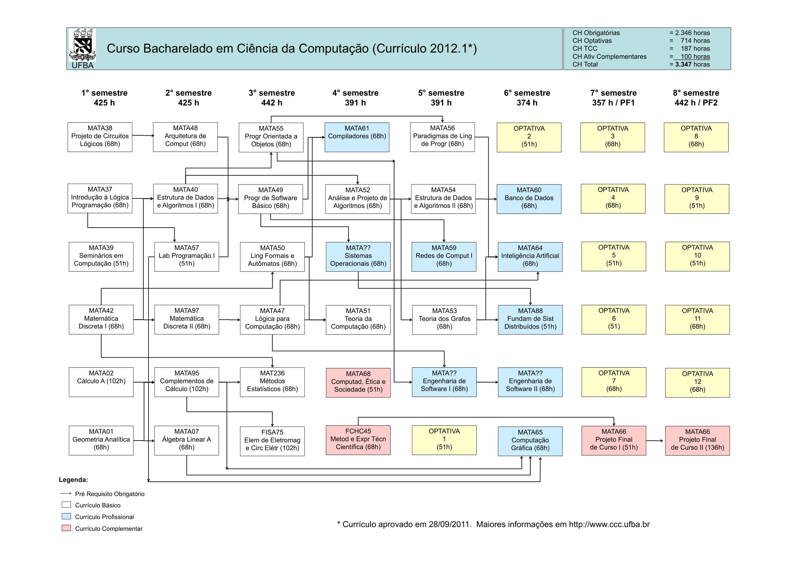

# Matérias Cursadas

### Gustavo Mendel

Bacharelado em **Ciência da Computação**. 

Em curso :mortar_board:

Desde 2019, até os dias atuais.

Pela Universidade Federal da Bahia (UFBA).

---
### Grade Curricular

---

|Legenda|Status|
|-----|------|
|:heavy_check_mark: |Completo|
|:heavy_plus_sign: | Em Curso|
|:heavy_minus_sign: |Não Iniciado|

### Situação

|Semestre| | | | | | |
|-|-|-|-|-|-|-|
|1|Projeto de Circuitos Lógicos  :heavy_check_mark:|Introdução à Lógica de Programação  :heavy_check_mark:|Seminário de Introdução ao Curso  :heavy_check_mark:|Matemática Discreta I  :heavy_check_mark:| Cálculo A  :heavy_plus_sign:|Geometria Analítica  :heavy_check_mark:
|2|Arquitetura de Computadores  :heavy_plus_sign:|Estrutura de Dados e Algoritmos I  :heavy_check_mark:|Laboratório de Programação I  :heavy_check_mark:|Matemática Discreta II  :heavy_minus_sign:|Complementos de Cálculo  :heavy_minus_sign:|Algebra Linear A  :heavy_plus_sign:|
|3|Programação Orientada a Objetos  :heavy_plus_sign:|Programação de Software Básico  :heavy_minus_sign:|Linguagens Formais e Autômatos  :heavy_minus_sign:|Lógica para Computação :heavy_minus_sign:|Métodos Estatísticos  :heavy_minus_sign:|Elementos de Eletromagnetismo  :heavy_minus_sign:
|4|Metodologia E Expressão Técnico-científica :heavy_minus_sign:|Teoria Da Computação :heavy_minus_sign:|Análise E Projeto De Algoritmos :heavy_minus_sign:|Sistemas Operacionais :heavy_minus_sign:|Compiladores :heavy_minus_sign:|Computador, ética e sociedade :heavy_minus_sign:|
|5|Teoria dos Grafos  :heavy_minus_sign:|Estrutura de Dados e Algoritmos II  :heavy_minus_sign:|Redes de Computadores I  :heavy_minus_sign:|Engenharia de Software I :heavy_minus_sign:|Paradigmas de Linguagem de Programação  :heavy_minus_sign:|Optativa 1  :heavy_minus_sign:|
|6|Banco de Dados  :heavy_minus_sign:|Inteligência Artificial  :heavy_minus_sign:|Computação Gráfica  :heavy_minus_sign:|Fundamentos de Sistemas Distribuídos  :heavy_minus_sign:|Engenharia de Software II  :heavy_minus_sign:|Optativa 2  :heavy_minus_sign:|
|7|Projeto Final de Curso I  :heavy_minus_sign:| Optativa 3  :heavy_minus_sign:| Optativa 4  :heavy_minus_sign:| Optativa 5  :heavy_minus_sign:| Optativa 6  :heavy_minus_sign:| Optativa 7 :heavy_minus_sign:|
|8|Projeto Final de Curso II  :heavy_minus_sign:|Optativa 8  :heavy_minus_sign:| Optativa 9  :heavy_minus_sign:| Optativa 10  :heavy_minus_sign:| Optativa 11  :heavy_minus_sign:| Optativa 12  :heavy_minus_sign:|
