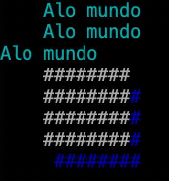

# Exercício incremental - parte 1

Abra o arquivo [Utils.java](src/main/java/br/ufba/poo/Utils.java) e complete o código de acordo com a especificação presente nos comentários.

Na classe `Utils` você também encontrará um método `main`, que exemplifica o uso dos métodos que você implementará. O resultado deve ficar da seguinte forma:

## Dica

A implementação do método `desenhaRetangulo()` pode ficar mais simples se você usar o método estático `StringUtils.repeat()`.

## Correção

A correção do exercício é automática, através de testes de unidade. Este repositório fornece alguns testes iniciais, que você pode executar no seu computador:

- Através do Eclipse: clique com o botão direito sobre `src/test/java`, então clique em `Run As` > `JUnit Test`
- Através da linha de comando: execute o comando `mvn test`

Ao submeter seu exercício através do GitHub, no entanto, ele será avaliado com **testes adicionais**, aos quais você não tem acesso.
